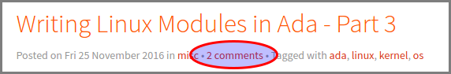

Migrating Blogofile to Pelican
###############################

:date: 2017/06/06 02:00:00
:tags: Blogofile, Pelican
:authors: Artium Nihamkin

Since I started writing this blog in 2012, I used `Blogofile <https://github.com/EnigmaCurry/blogofile>`_ as the blogging platform. 

Blogofile is a static website generator, meaning that the content is written and stored in a structured format like `Markdown <https://en.wikipedia.org/wiki/Markdown>`_, then it is compiled offline into a set of HTML pages that can be hosted on any web server, iregardless of it's technology. It can be even hosted cheaply on Amazon S3, which is what I am doing with this website. 

While Blogofile have served me well, It's development stalled for many years, and I felt that I wanted to try something new. 

After surveying modern website generators that are based on python, I decided to try `Pelican <https://blog.getpelican.com/>`_.

In this blog post, I will explain how I managed to migrate from Blogofile to Pelican.

Migration 
=========

First step was to follow the standard `instructions <http://docs.getpelican.com/en/3.6.3/install.html>`_ for installing Pelican and initializing a new blog.

In pelican, blog posts are stored in the *content* folder, so I copied all my Markdown files there.

Unfortunately, this does not work "out of the box". Some transformations on the files had to be made.

Removing ---
------------

Blogofile uses the *---* sequences to mark the header part of the Markdown file. Pelican does not need it and in fact will render it into the output html.

The problem is that one needs to be careful not to remove legitimate sequences like those that are part of a table definition.

.. code-block:: shell
    
    artium@melon:~/Projects/nihamkin.com/content$ (master) grep -r '\-\-\-' .
    ./24-about-the-danger-of-merge-conflicts.markdown:---
    ./24-about-the-danger-of-merge-conflicts.markdown:---
    ...
    ./20-msp430-with-ili9341-display.markdown:---
    ./20-msp430-with-ili9341-display.markdown:---
    ./20-msp430-with-ili9341-display.markdown:|:------------- |:--------:| -------:|
    ./19-esp82266-with-ili9341-display.markdown:---
    ./19-esp82266-with-ili9341-display.markdown:---
    ./19-esp82266-with-ili9341-display.markdown:|:------------- |:--------:| -------:|
    ...

Here is a snippet I used to remove only the illegitimate sequences automatically:

.. code-block:: shell
    
    find . -type f -exec sed -i -r '/^---$/d' {} \;

Please be **very careful** with this command. Run it only in the *content* directory.

If you run it from the wrong location, it might modify important files, so check and double check that you are running this correctly!

Replacing Categories with Tags
------------------------------

Blogofile uses the *Categories* keyword while Pelican uses *Tags* to describe the same thing.

This can be achieved easily with:

.. code-block:: shell

    find . -type f -exec sed -i 's/categories:/Tags:/g' {} \;
    
Code
----
Blogofile uses the :code:`$$code(lang=Ada)` syntax for syntax highlighted code blocks. Pelican's Markdown uses the :code:`::Ada`.

The following command will find all the places that use :code:`$$code`. 

.. code-block:: shell
    
    grep -r '$$code' .
    
I felt that doing the transformation by hand was quicker than writing a script. It all depends on the number of results of the command above.

Static Files
------------
My blog is hosting some static files which are not blog posts, such as images that are used in the posts. 

Blogofile uses *files* directory which was copied as-is to the output. In the blog posts, the following syntax was used to reference the image: :code:``

In Pelican, the static files are stored in *content/files*. The links on the blog posts do not have to change but *pelicanconf.py* needs to be aware that this folder contain static files:

.. code-block:: python
    
    STATIC_PATHS = [
        'files', 
        'extra', 
    ]

Not Breaking Existing Links
---------------------------

One of the most important point in the migration process is not to break inbound links to the old blog posts. Breaking links will affect SEO, make a mess in google analytics and might break Disqus comments.

In pelican, it is possible to force a specific URL for a blog post.

Here is an example of how it is done. Put the following code in the header section of the markdown file:

.. code-block::text
    
    url: 2016/11/25/writing-linux-modules-in-ada-part-3
    save_as: 2016/11/25/writing-linux-modules-in-ada-part-3/index.html

I went over all my pages manually and gave each the appropriate link.

Adding a Theme
---------------

There are large number of user created `themes <http://www.pelicanthemes.com/>`_ that are available for Pelican.

With Blogofile, I developed my own look and feel based on bootstrap. As I am not a designer, it was ugly and not mobile friendly.

With Pelican, I chose to use `Flex <https://github.com/alexandrevicenzi/Flex>`_ theme. The installation is straight forward so I will not repeat what is already described in the `documentation <http://docs.getpelican.com/en/3.6.3/settings.html#themes>`_.

Disqus Number of Comments
-------------------------
One of the things I felt was missing in Flex is a direct link from the main page to the comments section of a post, along with the number of comments.

I added this feature to Flex, as can be seen in the screenshot:

Until my pull request is approved, the changes to the templates can be viewed `here <https://github.com/alexandrevicenzi/Flex/pull/111/files>`_. 

Development vs. Production
--------------------------
One neat feature of Pelican is the ability to separate production and development configurations.

My use cases for this feature are:

* I want to use different Disqus sitenames for production and for testing.
* I do not want to use Google analytics when testing. 
* I want to use different site urls for testing (localhost) and production (my actual domain name). This is important because links in Pelican are generated with absolute paths based on :code:`SITEURL` parameter.
* I do not want to generate RSS/Atom when testing.

The production specific parameters are placed into *publishconfig.py*. These parameters will override the parameters in *pelicanconf.py* when publishing.

Here is an example of *publishconfig.py* from my blog:

.. code-block:: python
    
    #!/usr/bin/env python
    # -*- coding: utf-8 -*- #
    from __future__ import unicode_literals
    
    # This file is only used if you use `make publish` or
    # explicitly specify it as your config file.
    
    import os
    import sys
    sys.path.append(os.curdir)
    from pelicanconf import *
    
    SITEURL = 'http://www.nihamkin.com'
    RELATIVE_URLS = False
    
    FEED_ALL_ATOM = 'feeds/all.atom.xml'
    CATEGORY_FEED_ATOM = 'feeds/%s.atom.xml'
    
    DELETE_OUTPUT_DIRECTORY = True
    
    # Following items are often useful when publishing
    
    DISQUS_SITENAME = "artiumsblog"
    GOOGLE_ANALYTICS = "UA-36977465-1"

Deploying to S3
----------------
Deploying to S3 is build-in with Pelican. Simply run :code:`make s3_upload` and the script will guide you through the configuration.

