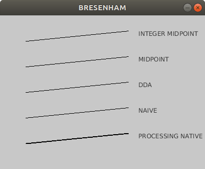

Line Rasterisation
##################

:date: 2018/08/06 21:00:00
:tags: Computer Graphics, Processing
:authors: Artium Nihamkin

.. role:: c(code)
   :language: c

Sometimes even the simplest things are not as simple as they look.

Recently, I had a task that required me to understand circle rasterisation.
So I went back to my computer graphics course notes which I took many years ago
to remind myself about how lines are drawn on a computer screen.

Lines are mathematical objects, on the other hand a screen is built out of a
pixel grid of a finite resolution.

Even if the endpoints of the line correspond exactly to specific pixels,
the line itself is not. It needs to be approximated by these pixels.

The process of deciding which pixels should be turned on to approximate the
line is called **rasterisation**.

Reading the material again after that many years, I sharpened my understanding
a bit and now hope to share some of the insights.

Naive algorithm
===============

The simplest way to implement this is to step over every integer value of
:code:`x` and use :code:`y = mx + d` function to calculate :code:`y`. The value
of :code:`y` is not an integer, it is a real number. And since pixel grid is an
integer grid, it needs to be rounded to the closest integer.

I will use `processing <https://processing.org/>`_ tool for the demonstration:

Please notice that 300 is the height of the drawing area and the horizontal
axis is inverses. Additionally, the :code:`plot_y` offset parameter has
nothing to do with the algorithm. It is just my way to control that each
implementation plots it's result on a different on the screen. These is the
reason for the :code:`300 - (round(y) + plot_y_offset)` calculation.

For simplicity, through this article, I will consider only lines with
:code:`0 < m < 1` and :code:`x0 < x1` (lines which are vectors in the first
octant). Other cases (there are 8 of them) can be solved similarly by a
combination of reversing the order of the points, by iterating over :code:`y`
instead of :code:`x` and by reflecting around :code:`x` axis. Also vertical,
horizontal and diagonal lines have to be dealt with as edge cases.

.. code-block:: c

    /*
     * Draw a line pixel by pixel using the most naive algorithm
     */
    void line_naive(int x0, int y0, int x1, int y1, int plot_y_offset)
    {
      float m = float(y1 - y0) / float(x1 - x0);
      float b = y0 - m * x0;

      for (int x=x0; x<=x1; x++) {
        float y = (float(x) * m + b);
        set(x, 300 - (round(y) + plot_y_offset), black);
      }
    }

There are several inefficiencies in this implementation.

1. For every pixel, there is a floating point multiplication.
2. For every pixel, there is a floating point rounding operation.
3. For every line, there are several more floating point operations,
   including multiplication and division.

Number 3 is relevant if you plan to draw large number of lines, which most of
the applications require.

Digital Differential Analyzer
=============================

Digital Differential Analyzer (DDA) is just a fancy way of saying *lets do
increments instead of multiplication*.

Naive implementation calculates :code:`float(x) * m` every iteration of the
loop. DDA on the other hand uses accumulator and increments by :code:`m` every
iteration. This replaces single floating point multiplication, with an
addition.

.. code-block:: c

    /*
     * Draw a line pixel by pixel using the DDA technique:
     */
    void line_dda(int x0, int y0, int x1, int y1, int plot_y_offset)
    {
      float m = float(y1 - y0) / float(x1 - x0);
      float b = y0 - m * x0;
      float curr_y = y0;

      for (int x=x0; x<=x1; x++) {
        set(x, 300 - (round(curr_y) + plot_y_offset), black);
        curr_y += m;
      }
    }

Bresenham's Midpoint
====================

This step actually does not make the algorithm more efficient. It is an
intermediate step before the final version of the algorithm.

Rounding should be not slower than comparing two floating point numbers because
that is what actually rounding is about. More than that, depending on the
implementation, rounding can be implemented efficiently in hardware and it
could be faster.

.. code-block:: c

    /*
    * Draw a line pixel by pixel using the Bresenham's midpoint algorithm
    */
    void line_midpoint(int x0, int y0, int x1, int y1, int plot_y_offset)
    {
      float m = float(y1 - y0) / float(x1 - x0);

      float midpoint_f = (float)y0 + 0.5;
      float curr_y = (float)y0;
      int plot_y = y0;

      set(x0, 300 - (y0 + plot_y_offset), black);
      for (int x = x0+1; x <= x1; x++) {

        if (curr_y > midpoint_f) {
          plot_y ++;
          midpoint_f += 1.0;
        }
        curr_y += m;

        set(x, 300 - (plot_y + plot_y_offset), black);
      }
    }

Now, since you know the motivation behind using comparison, let's dive into the
details.

If we look at a pixel :code:`(x,y)` that was drawn at some iteration step of
the loop, there are only two possible locations for the next pixel. Either one
pixel to the right :code:`(x+1,y)` or one pixel to the right and one pixel up
:code:`(x+1,y+1)`. This behavior is due to constraints that were put on the
slope and the order of the points.

So how to decide which pixel to take? One way already demonstrated was to
calculate the real :code:`y` and round it to the nearest integer value.

Another way is to calculate the middle point between these two pixels and to
compare it to :code:`y`. If the midpoint (sometimes called a threshold) is
higher, then the algorithm draws the upper right pixel, otherwise it draws the
pixel to the right.

The midpoint is updated incrementally every time pixel's :code:`y` is changed.

Bresenham's Midpoint with Integer
=================================

Now comes the final trick. Can you implement the previous algorithm without
using a single floating operation? `Jack Elton Bresenham <https://en.wikipedia.org/wiki/Jack_Elton_Bresenham>`_
could do this.

.. code-block:: c

    /*
    * Draw a line pixel by pixel using integer only operations in the for loop.
    */
    void line_midpoint_integer(int x0, int y0, int x1, int y1, int plot_y_offset)
    {
      int dx = x1 - x0;
      int dy = y1 - y0;

      int midpoint = (2*y0 + 1) * dx; // (y0 + 0.5) * 2.0) * dx;
      int midpoint_inc = 1 * 2 * dx;
      int curr_y = y0 * 2 * dx;
      int curr_y_inc = 2 * dy;        // m * 2.0 * dx

      int plot_y = y0;

      set(x0, 300 - (y0 + plot_y_offset), black);
      for (int x = x0+1; x <= x1; x++) {

        if (curr_y > midpoint) {
          plot_y ++;
          midpoint += midpoint_inc;
        }
        curr_y += curr_y_inc;

        set(x, 300 - (plot_y + plot_y_offset), black);
      }
    }

Since the algorithm draws on pixels )integer coordinates) the only reason for
floating point operations is the midpoint comparison part.
Since it is a comparison and not a calculation, it is ok to apply mathematical
operations on both sides of the equation.

So to make :code:`midpoint` integer we multiply both side by :code:`2` and to
make :code:`curr_y` integer, we multiply both sides by :code:`dx` (because :code:`curr_y = x*m = x * (dy/dx)`)
Of course, the increments need to be updated as well.

Conclusion
==========

The processing file that sums up this blog post can be found
`here <files/bresenham_lines/bresenham_lines.pde>`_. I did not implement all
different cases the endpoints could be arranged.

It runs each algorithm 10,000 times and outputs the frame rate.
It was a surprise to me that all the implementations had roughly the same fps
except for the *non* integer midpoint which was a little faster (60 vs 65). No
comment on this right now.
