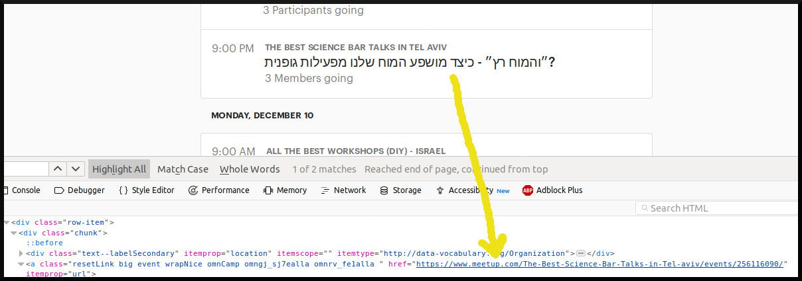

Filtering Meetup Organizers with Greasemonkey Script
####################################################

:date: 2018/12/08 18:00:00
:tags: Javascript, Greasemonkey
:authors: Artium Nihamkin

.. role:: javascript(code)
   :language: javascript

I love meetups. It is a great opportunity to learn new things and expose myself
to new ideas. I manly interested in the technological stuff, but I am not
picky. Great concepts, ideas and life lessons has the quality of being
applicable across multiple fields.

Every two weeks or so, I go to `meetup.com <https://www.meetup.com/>`_, choose
"All Meeteups" and browse for interesting meetings in the following two weeks.

The problem is that there is a lot of clutter. Meetup allows to select which
organizers I am interested in, but I want to select which organizers I am not
interested in. I still want to see new stuff, but if I decided that something
is not relevant to me, then I want to filter it out in the future.

Meetup does not allow filtering out specific organizers, So I decided to write
a `Greasemonkey <https://addons.mozilla.org/en-US/firefox/addon/greasemonkey/>`_
script to do this for me.

Greasemonkey is plugin for firefox that allows running user defined scripts
written using Javascript. The scripts will run only when a page matching a
specific pattern is opened by the browser.

Here is the script which does the filtering. It is pretty simple. You can allo
install it from `here <https://greasyfork.org/en/scripts/375325-filter-out-meetup-search-results>`_.

.. code-block:: javascript

    // ==UserScript==
    // @name     Filter Out Meetup Search Results
    // @version  4
    // @description Remove items from search results of meetup.com based on regular expression. Personally I use this to filter out organizers that are not relevant to me.
    // @author      Artium Nihamkin artium@nihamkin.com
    // @icon https://secure.meetupstatic.com/s/img/68780390453345256452178/favicon.ico
    // @homepageURL    http://www.nihamkin.com
    // @include https://www.meetup.com/*
    // @require http://ajax.googleapis.com/ajax/libs/jquery/1.9.1/jquery.min.js
    // ==/UserScript==

    function f() {

        // You need to edit this with your own filtering keywords. The regular expression
        // is run against href attributes of the search result links.
        // See http://www.nihamkin.com/filtering-meetup-organizers-with-greasemonkey-script.html
        //
        var blacklist = ["All-the-best-Workshops-DIY-Israel", "The-Best-Science-Bar-Talks-in-Tel-aviv"];
        var blRegex = new RegExp(blacklist.join("|"));

        var links = $("a").filter(function(i,el) { return (blRegex.test(el.href)); })
          .closest("li.event-listing")
          .remove();
    }

    document.body.addEventListener("DOMNodeInserted", f, true);

First, some comparisons before and after:

|pic1| |pic2|

Now I will explain how function :code:`f` works. The :code:`blacklist` array
is an array of patterns.
These patterns should match the url of the meetup pages you want to
filter out. Since all meetup page urls contain the organizer name, I used it
as a filter criteria.

After building the regular expression, the filtering will happen. This task is
assisted by jquery library which is imported in the :code:`@require` line.

First it finds all :code:`a` tags whose :code:`href` match the regular
expression, jquery is asked to look up the DOM tree for the first occurrence of
:code:`li` tag with :code:`event-listing` class. This :code:`li` tag is the
container of the whole box, and thus it is removed to hide it.

Finally it is important to tell when function :code:`f` should actually run.
I hooked the  :code:`DOMNodeInserted` event because the meetup search results
page is dynamic.
It use Ajax to load more items as the user scrolls down and presses the "More"
button. Therefore it is important to filter out any new search results as they
appear on the page.

In conclusion, if you are familiar with Javascript then Greasemonkey can be a
simple but powerful tool for personalizing the experience you have with your
frequently visited websites.
