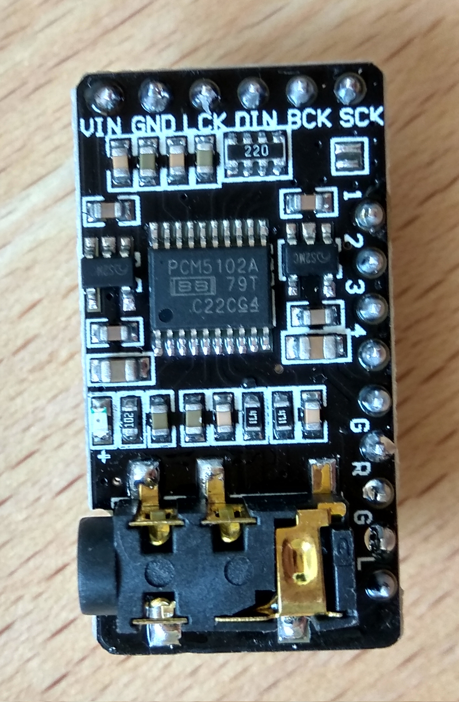
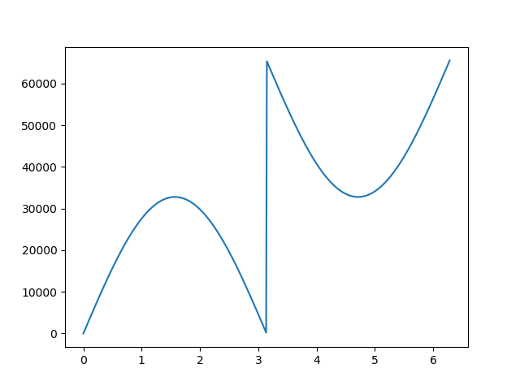

PCM Audio on ESP8266 using the PCM5102 Chip
###########################################

:date: 2019/08/22 23:00:00
:tags: esp8266, arduino, embedded, ili9341
:authors: Artium Nihamkin
:category: ESP8266/ESP32

.. role:: c(code)
   :language: c

One of the projects I am currently working on is a text to speech system based
on ESP8266 (or more realistically - ESP32). It will utilize the CMU Flite
speech synthesis library. But a way to play back the synthesized waveform is
also required.

For this propose, I will use a `PCM5102
<http://www.ti.com/lit/ds/slas764b/slas764b.pdf>`_ chip that will convert
digital data sent from the ESP8266 over I2S to analog signal that drive the
connected speaker.

ESP2866 has a hardware implemented I2S, so specific pins are required. Here is
the table showing the connections I have made.

+--------------+------------+-------------+
| ESP8266 Name | ESP8266 IO | PCM5102 Pin |
+==============+============+=============+
| MTDO         | IO 15      | BC(L)K      |
+--------------+------------+-------------+
| U0RXD        | IO  3      | DIN         |
+--------------+------------+-------------+
| GPIO2        | IO  2      | L(R)CK      |
+--------------+------------+-------------+
| Connect to 3.3V           | VIN         |
+--------------+------------+-------------+
| Connect to GND            | GND         |
+--------------+------------+-------------+

If you want to use the other pins which control certain aspects of the chips
behavior, you can refer to the `data-sheet
<http://www.ti.com/lit/ds/slas764b/slas764b.pdf>`_. I did not connect any other
pin on the breakout board of the PCM5102.

The full I2S protocol is explained on wikipedia better than anything I could
write. Here are few bullets to help you understand the code which appear later:

- Data words are 16 bits two's complement.
- Each data word represents the magnitude of the wave front at specific point in time (this is called `PCM <https://en.wikipedia.org/wiki/Pulse-code_modulation>`_)
- There are two data words for each sample representing left and right channels.
- The sample rate is, as the name suggests, number of samples (and not words) per second.
- Here, I will not utilise stereo, so each sample's left and right channels will be identical.

Ok, so first let's create 512 samples of a sine array using a python script:

.. code-block:: python

    import matplotlib.pylab as plt
    import numpy as np

    def chunks(l, n):
        """Yield successive n-sized chunks from l."""
        for i in range(0, len(l), n):
            yield l[i:i + n]

    SAMPLES = 512

    x = np.linspace( 0, 2.0*np.pi, SAMPLES) 
    y = list( (int(a) if a >= 0 else int(2**16 + a) for a in  (np.sin(x)) * 2**15 ) )

    for row in chunks(y, 8):
        print ("".join(("{0:#0{1}x}, ".format(word,6) for word in row)))

    plt.plot(x, y)
    plt.show()

The above script prints the samples in a format suitable for embedding into a C
source file.

Few things to notice:

- The graph does not look like a sinus. This is because we are looking at
  unsigned values which represent signed data. So for example 0x8000 is actually
  -32768.
- The start of the wave is at the value of 0, which represents the
  diaphragm of the speaker at resting position. Other values would mean a
  sudden jump to the requested position, which will add a little bit of noise.
- There is no no intention to use stereo. The same values will be sent to both
  channels. Thus the "samples" are single data words and not pairs.

Using this data it will be possible to generate sine waves of
various frequencies (also known as *pitches*).

The ESP8266 implementation of Arduino environment has a built in library for
sending I2S data. All the function signatures can be found in `i2s.h
<https://github.com/esp8266/Arduino/blob/master/cores/esp8266/i2s.h>`_.

In the setup function, I set up the I2S to use 44100 Hz sample rate and the CPU
to run at 160 MHz:

.. code-block:: c

    #include "ESP8266WiFi.h"
    #include "i2s.h"
    #include "i2s_reg.h"

    #define RATE 44100

    void setup() {
    system_update_cpu_freq(160);

    i2s_begin();
    i2s_set_rate(RATE);
    }

On the ESP8266, I created a function that is similar to Arduino's `tone
<https://www.arduino.cc/reference/en/language/functions/advanced-io/tone/>`_
function. But this one is not a puny, square wave, piezzo buzzer driver:

.. code-block:: c

    #define SINE_SAMPLES 512

    int16_t sine[SINE_SAMPLES] = { ... } // Paste here the generated samples from the python script

    /**
    * Outputs a sine waveover I2S of the requested frequency for the 
    * requested duration of milliseconds.
    */
    void writeNote(uint32 freq, uint32 duration) 
    {
        if (freq == 0 || duration == 0) {
            return;
        }
        // Number of samples required for the requested duration
        uint32 totalSamples = (RATE * duration) / 1000;

        // Number of samples in full period of a sine wave for that particular frequency
        uint32 samplesPerPeriod = RATE / freq; 

        // Round down total samples to an integer number of sine periods
        totalSamples = (totalSamples / samplesPerPeriod) * samplesPerPeriod;

        for (uint32 i = 0; i < totalSamples; i++) {
            uint32 sampleIdx = map(i % samplesPerPeriod, 0, samplesPerPeriod, 0, SINE_SAMPLES);  
            i2s_write_lr( sine[sampleIdx],  sine[sampleIdx]);
        }

        delay(50);
    }

You can hear in the following video, the tune of star wars played using
:code:`writeNote` function. The full source of the Arduino sketch can be found `here <https://gist.github.com/alkhimey/a705d563aaa9a470332e7ad5487d7d0e>`_.

.. youtube:: bSYEUzV3nFE

Next thing I will do is playing back WAV files. Stay *tuned* ;)