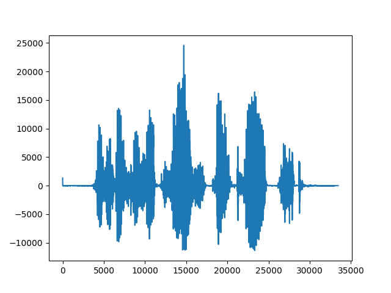

Playing WAV Files on ESP8266
############################

:date: 2019/09/15 03:00:00
:tags: esp8266, arduino, embedded, ili9341
:authors: Artium Nihamkin
:category: ESP8266/ESP32

.. role:: c(code)
   :language: c

In the previous post, ESP8266 was playing music based on pitch sequences and a
recording of a sine wave. This is not sufficient for the speech sythesis
system. A method for playing WAV files is required.

Fortunately, WAV format uses  PCM to represents the waveform. Thus the data can
be directly fed into PCM5102.

For a test, I synthesized a simple WAV file using desktop version of Festival.

.. raw:: html

   <audio controls="controls">
         <source src="/files/esp8266/this_is_an_example_text.wav" type="audio/wav">
         Your browser does not support the <code>audio</code> element.
   </audio>

Next, I parsed this file using Python script. `This
<http://soundfile.sapp.org/doc/WaveFormat/>`_ description of the WAV format was
very helpful.

The script can be found at `this link
<https://gist.github.com/alkhimey/55eb4d4b03b680b1f5742ec513aeb071>`_. It's
input is a WAV file and it produces an H file looks like this:

.. code-block:: c

    #ifndef WAV_DATA
    #define WAV_DATA

    #define NUM_SAMPLES 33442
    #define SAMPLE_RATE 16000

    int16_t data[NUM_SAMPLES] PROGMEM = {
        
        .... // samples
    
    };
    #endif

Please keep in mind that I work with WAV files produced by Festival, and thus
the script assumes that the input WAV file has 1 channel and 16 bits per sample.
It can be extended to support any kind of WAV file. For me this was not worth
the effort since the script is used only for testing/experimenting.

This H file is included into the most simple Arduino sketch:

.. code-block:: c

    #include "ESP8266WiFi.h"
    #include "i2s.h"
    #include "i2s_reg.h"

    #include "wav_data.h"

    void setup() {
        system_update_cpu_freq(160);
        i2s_begin();
        i2s_set_rate(SAMPLE_RATE);
    }

    void loop() 
    {  
        for(size_t i = 0; i < NUM_SAMPLES; i++) {
            uint16_t ua = pgm_read_word_unaligned( &(data[i]));
            int16_t a;
            memcpy(&a, &ua, sizeof(int16_t)); // reinterpret bits of unsigend into a signed value
            i2s_write_lr(a,a);
        }

        delay(3000);
    }

It looks straight forward except the use of :code:`PROGMEM` macro and the strange
memory access.

The WAV file is too big to fit into ESP8266 RAM, therefore it has to be stored on
the FLASH and the samples have to be read from there. :code:`PROGMEM` macro
hides a compiler directive that tells it to put the :code:`data` array into the
:code:`irom.text` section.

Although most of the ESP8266 FLASH is memory mapped, only 32 bit aligned access
is allowed. Since the samples in the array are 16 bit of length, it is not
possible to access individual array element even if the whole array is
correctly aligned.

The :code:`pgm_read_word_unaligned` function is a built in way of accessing a
16 bit word from FLASH. Behind the scenes it calculate the aligned address,
retrieves a 32 bit value and returns only the relevant part of it in the form
of 16 bit unsigned value. The :code:`memecpy` call is just a portable way to
reinterpret the unsigned value into a signed value (that is what stored in the
data array in the first place).

Since this is part of a project with a goal to run speech synthesis on the ESP
hardware, the next thing is to actually port `flite <http://www.festvox.org/flite/>`_ to ESP.

