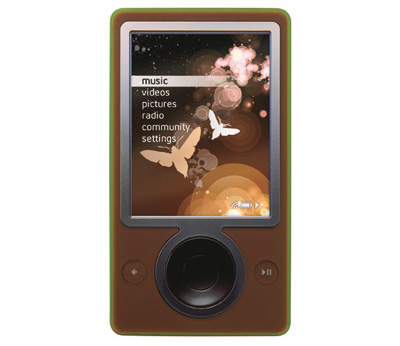
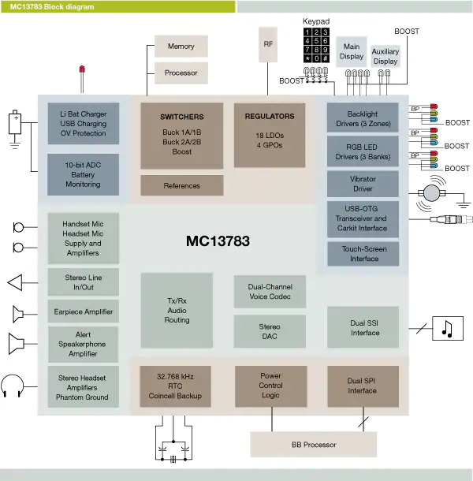

Zune Leap Year Freeze
#####################

:date: 2020/01/25 02:00:00
:tags: Bugs, Embedded, Software Engineering
:authors: Artium Nihamkin
:category: Software Fails
:cover: files/zune/zune30.jpg

.. role:: c(code)
   :language: c

I am starting a new series of blog posts in which I will do analysis of famous
bugs and system design failures related to software. I will attempt to present
more technical analysis than what is available when reading about these
stories in the mainstream media.

I love reading about "failure" stories. It is a great entertainment but can
also be an educating experience which inspire me to think or do things
differently. Hope it will be relevant to you as well.

Zune
====

`Zune 30 <https://en.wikipedia.org/wiki/Zune_30>`_ was a 30GB media
players developed by Microsoft and released in 2006.  It was the era of the
iPod and Microsoft wanted a portable media player oas well.

At midnight of December 31, 2008, all the millions of Zune 30 that Microsoft
sold started malfunctioning. When turned on, they would freeze on the loading
screen.

Before looking at the code that caused the bug, lets understand how consumer
electronic products are usually developed.

A hardware component manufacturer develops a component tailored for specific
product class. For example a DSP chip for surveillance cameras, a WIFI
communication chip for cell phones or a system on chip with all the necessary
peripherals for a portable media player.

Along with this chip, the manufacturer develops a reference product. The design
of the reference product is released and includes design documents, schematics,
PCB layout and relevant code.

A consumer product manufacturer will not do R&D from scratch, it will license
the reference design and "differentiate" it. Each manufacturer changes the
design slightly and thus we get a range of different product.

In our case microsoft used the Freescale MC13783 chip. This chip handles
power management and audio and is designed specifically to be used in portable
media players. 

Among other things, this chip handles the real time clock. This is a clock
powered by an auxiliary power source and is supposed to keep time when the
device is turned off.

At startup, Zune's main processor would load the time from the real time clock
in days since 1980 and convert to a proper date (day, month, year).  Here is a
snippet of a driver code that does the conversion to the current year:

.. code-block:: c

    BOOL ConvertDays(UINT32 days, SYSTEMTIME* lpTime) 
    {
        ...
        year = ORIGINYEAR; /* = 1980 */

        while (days > 365)
        {
            if (IsLeapYear(year))
            {
                if (days > 366)
                {
                    days -= 366;
                    year += 1;
                }
            }
            else
            {
                days -= 365;
                year += 1;
            }
        }
        ...
    }

Can you spot the bug?

Before revealing the answer, let me help with some clues:

1. Zune froze, how can this snippet cause the device to freeze?

| .
| .
| .
| .
| .
| .
| .
| .

2. What is special about December 31?

| .
| .
| .
| .
| .
| .
| .
| .

3. What is special about 2008?

| .
| .
| .
| .
| .
| .
| .
| .

Let's address these three questions one by one. The freezing could have been
caused by an infinite loop. This happens if :code:`days` never gets smaller
than :code:`366`.

The date of this incident is December 31, which is the last day of the year. It
could be the 365th day of that year or if it is leap year it will be the 366th
day. Speaking of a leap year, 2008 was indeed a leap year. 

After several iterations of the while loop, we end up with :code:`days` equal
366. The code enters the first :code:`if` but does not enter the second. The
state during the execution of the next iteration is identical since nothing
has changed, and thus the loop will run infinitely.

..
    So why did not Zune reset itself? First we need to ask why should it have reset
    itself. It is very common for embedded devices to have a *watchdog* components.
    This is a special hardware component which needs to receive a signal from the
    software running on the CPU that it is indeed running and not "stuck" in some
    way. The operating system usually feeds the watchdog at context switches and it
    can also be fed explicitly while executing specific time consuming operations.
..

Full disclosure, `here is a link
<https://web.archive.org/web/20140105235759/http://www.zuneboards.com/forums/showthread.php?t=38143>`_
for reference I used for this blog post.

Obviously this issue resolved itself on January the first. Until next leap year
at least, but I doubt there were many Zune users at that time.

Takeaway
========

1. Non simple recalculation of the loop counter inside the body of the loop is
a smell. I have seen coding standards that forbid the use of :code:`while`
loops and force the :code:`for` loops to be "well formed", partly because of
this reason.

2. Time and date calculations are complicated and have a lot of edge cases. You
can watch `this video  <https://www.youtube.com/watch?v=-5wpm-gesOY>`_ to get a
reinforcement of this view.
