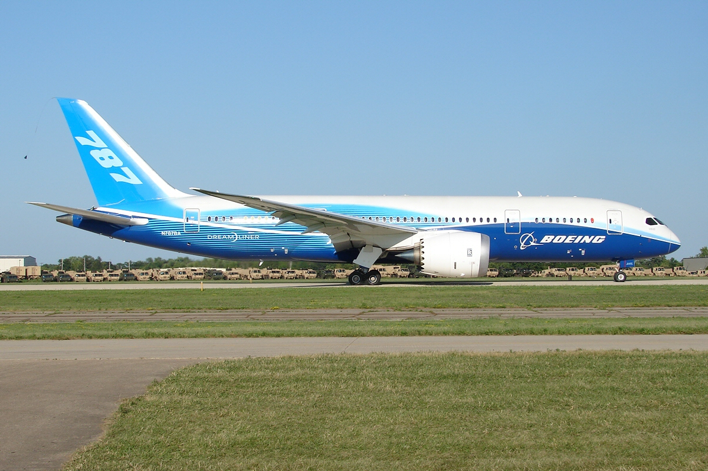

Boeing 787 Dreamliner and the Counter Overflow
##############################################

:date: 2020/02/29 23:00:00
:tags: Bugs, Embedded, Software Engineering
:authors: Artium Nihamkin
:category: Software Fails
:cover: files/dreamliner/The_Boeing_787_Dreamliner.jpg

This is another post in a series which covers famous software failures. Today's
failure is not very old nor it is very famous.

In 2015, the *Federal Aviation Administration* (FAA) issued and *Airworthiness
Derivative* (AD) regarding Boeing's
flagship aircraft at that time, the 787 Dreamliner.
 
In the AD, they `write <files/dreamliner/2015-10066.pdf>`_:

    We have been advised by Boeing of an issue identified during laboratory
    testing.  The software counter internal to the generator control
    units(GCUs) will overflow after 248 days of continuous power, causing that
    GCU to go into failsafe mode. If the four main GCUs (associated with the
    engine mounted generators) were powered up at the same time, after 248 days
    of continuous power, all four GCUs will go into fail safe mode at the same
    time, resulting in a loss of all AC electrical power regardless of flight
    phase.

So what is going on here? Let's break down and analyze.

Discovery
---------

First of all, this bug was discovered during lab testing. It was discovered
after the aircraft became operational. How is it possible? There are two
possible explanations that I can think of. First, it could have been discovered
during the testing of the next software version. Other explanation is that FAA
certifies aircraft even though the testing of the aircraft's components is not
complete at the time of the certification. Powering the aircraft's avionics
systems for such long period and checking that it still works properly can be
such test.

Ok, so what is a *GCU*? 
-----------------------

It stands for *Generator Control Unit*, this is an embedded device which
controls the generation of electric power produced by rotation of the engines.
Usually there is one generator for each engine but the Dreamliner has two.

Loosing the GCU's can potentially lead to losing all power. On modern aircraft,
the pilot is not controlling the flight surfaces directly. Instead, stick and
throttle movements, along with a bunch of sensor data, are used as an input
into a flight computer. The computer calculates how the flight surfaces should
be moved and outputs commands to actuators. Without power, this process can not
work which means the pilot can not control the aircraft anymore.

Overflow
--------

We also know that the GCU went into a failsafe more due to counter overflow
after 248 days. So what is so special about 248 days?

.. table::
    :widths: 20 30 50

    +----------------+-------------------------+---------------------------------+
    | 248 days       | 248 X 24 X 3600 seconds | 2,142,720,000  ✕10 milliseconds |
    +----------------+-------------------------+---------------------------------+
    | :math:`2^31`   |                         | 2,147,483,648                   |
    +----------------+-------------------------+---------------------------------+
    | 249 days       | 249 X 24 X 3600 seconds | 2,151,360,000  ✕10 milliseconds |
    +----------------+-------------------------+---------------------------------+

Based on this, we can guess that this counter is 32 bit signed integer and it
is being incremented once every 10ms. Somewhere during the 248th day it
overflows. If all the GCUs on the aircraft start approximately at the same
time, they will go into failsafe mode at the same time and thus could leave the
aircraft without power. This is not fatal as there is a backup generator
powered by the flow of air which deploys in such situations. Nevertheless this
is a very dangerous situation.

Solution
--------

Until a software fix was ready, the AD requires aircraft operators to cycle
power to the GCU's every 120 days.

    AD Requirements

    This AD requires a repetitive maintenance task for electrical power deactivation.

    Interim Action

    We consider this AD interim action. The manufacturer is
    currently developing a GCU software upgrade that will address the unsafe
    condition identified in this AD. Once this software is developed, approved,
    and available, we might consider additional rulemaking.

I don't know how common it is for an aircraft to operate for 120 days
continuously powering it's electrical systems. The 787 is not an aircraft that
you power off "at the end of the day". There is no such concept at all as every
minute the aircraft is not in the air, the operator is losing money. It might
even go to maintenance while still being powered on.

Airbus A350
------------

In 2017, on the other side of the ocean, Airbus had a similar issue. This time
it was an overflow every 149 hours.

For the sake of completeness hare is a `link to the AD
<https://ad.easa.europa.eu/ad/2017-0129R1>`_ published by European Union
Aviation Safety Agency (EASA) and a similar table as for the 787 case:

.. table::
    :widths: 20 30 50

    +----------------+-------------------------+-----------------------------+
    | 149 hours      | 149 X 3600 seconds      | 536,400,000  ✕ milliseconds |
    +----------------+-------------------------+-----------------------------+
    | :math:`2^29`   |                         | 536,870,912                 |
    +----------------+-------------------------+-----------------------------+
    | 150 hours      | 150 X 3600 seconds      | 540,000,000  ✕ milliseconds |
    +----------------+-------------------------+-----------------------------+

My guess is that the counter is a signed fixed point number with an LSB of
:math:`0.25`, but this is of course just a speculation.

